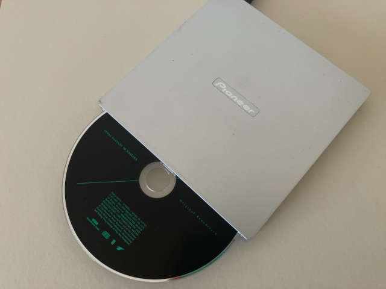

# foo_input_wave_loop

WAV ファイルの無限ループ再生を行う foobar2000 コンポーネント

foobar2000 component for infinite loop playback of WAV file

&nbsp;

## 目次 - Contents

 - [このソフトウェアについて](#このソフトウェアについて---about-this-software)
 - [ソフトウェアのダウンロード](#ソフトウェアのダウンロード---download-software)
 - [動作環境](#動作環境---operating-environment)
 - [サポートするファイルの種類](#サポートするファイルの種類---supported-file-types)
 - [WAVファイルにループポイントを付加する方法](#wavファイルにループポイントを付加する方法---how-to-append-the-loop-point-to-wav-file)
 - [CUEシートの書式](#cueシートの書式---playback-using-cue-sheet)
 - [使用例](#使用例---example-of-use)
 - [本ソフトウェアのライセンスについて](#本ソフトウェアのライセンスについて)
 - [製作メモ](#製作メモ)

&nbsp;

## このソフトウェアについて - About this software

本ソフトウェアは、foobar2000 でループポイント情報を持った WAV ファイルをループ再生するためのコンポーネントです。WAV ファイルの正式な仕様であるループポイント情報のほか、ID3 タグ情報 "LOOPSTART"，"LOOPLENGTH" にも対応します。

This software is foobar200 component to play WAV file that has loop point information. This component supports regular loop point and also ID3 tag ("LOOPSTART" and "LOOPLENGTH").

【 Caution ! 】

　foobar2000 本体の WAV ファイル再生用コンポーネントとの衝突を避けるため、本コンポーネントは拡張子が ".wavloop" のファイル（".wav" ではない）に適用される仕様にしています。そのため、ループ再生したい WAV ファイルがあれば、拡張子を ".wavloop" に変更した上でご利用ください。

To avoid the conflict with foobar2000 standard input component, this component is applied to ".wavloop" file, not to ".wav" file. So you need to change the extension of WAV file to ".wavloop" for loop playback.

&nbsp;

## ソフトウェアのダウンロード - Download software

こちらのページから拡張子が「.fb2k-component」のファイルをダウンロードしてください。

&emsp; https://www.github.com/suwasakix/foo_input_wave_loop/releases

&nbsp;

## 動作環境 - Operating environment

本ソフトウェア (v1.1) は、以下の環境で動作することを確認しています。

- foobar2000 v2.1.4 (x64) on Windows 11
- foobar2000 v2.1.4 (x86) on Windows 11
- foobar2000 v1.6.17 on Windows 11

&nbsp;

## サポートするファイルの種類 - Supported file types

- "smpl" チャンクにループポイント情報を持つ WAV ファイル
- ID3 タグに、RPGツクール形式のループポイント情報 (LOOPSTART と LOOPLENGTH) を持つ WAV ファイル

  - ループポイントを持つファイルは、再生時間が 1d 0:00:00 のファイルとして認識されます。
  - ループ再生中、シークバーで再生時刻を変更することはできません。
  - フォーマット形式は PCM のみサポートします。
  - "smpl" チャンクに複数のループポイント情報が存在する場合には、最初のループポイント情報のみが使用されます。
  - ID3v2.3 と ID3v2.4 に対応します。
  - 両方のループ情報を持つ場合には、"smpl" チャンクの情報が優先されます。


- WAV file containing "smpl" chunk with loop points
- WAV file containing "LOOPSTART" and "LOOPLENGTH" (defined by RPG Maker) in ID3 tag

  - This component considers the duration of file with loop point as "1d 0:00:00" (1 day).
  - In case of loop playback, you cannot change play time by seekbar.
  - Support only PCM format.
  - When the "smpl" chunk has plural loop point information, only first loop point is referred.
  - Support ID3v2.3 and ID3v2.4.
  - If the file has both "smpl" chunk and ID3 tag, this component get only "smpl" chunk information.

&nbsp;

## WAVファイルにループポイントを付加する方法 - How to append the loop point to WAV file

#### WAVファイルに "smpl" チャンクを付加する場合 - Case of appending "smpl" chunks to WAV file

音声編集ソフト Wavosaur で "smpl" チャンクのループポイントを編集することが可能です。  
Wavosaur は[このサイト](https://www.wavosaur.com)からダウンロードできます。  

You can edit the loop points of "smpl" chunks by Wavosaur.  
Wavosaur can be downloaded from [this site](https://www.wavosaur.com).  

&nbsp;

#### WAVファイルに ID3 タグを付加する場合 - Case of appending ID3 tags to WAV file

音声編集ソフト Audacity で ID3 タグを編集することが可能です。  
Audacity は[このサイト](https://www.audacityteam.org)からダウンロードできます。  
You can edit the ID3 tags by Audacity.  
Audacity can be downloaded from [this site](https://www.audacityteam.org).  

&nbsp;

##### ループポイントの作成手順 - How to append the loop point by Audacity

1. Audacity を起動後、メニューの「編集(E)」→「設定(F)...」を選択し、「品質」カテゴリーの「高音質変換 - ディザリング(h)」を「無し」に設定します。  

   ※ ディザリングの設定を「無し」にしなかった場合、WAV ファイルを読み込んだ際にディザリング処理が実行されてしまい、音声データが WAV ファイルの編集前後でバイナリ一致しなくなります。

2. WAV ファイルを開きます。  

3. メニューの「ファイル(F)」→「書き出し(E)...」を選択し、ファイル名を入力して「保存(S)」をクリックします。  

4. 「メタデータを編集」ウィンドウが表示されるので、タグの欄に "LOOPSTART" および "LOOPLENGTH" を追加し、それぞれのループポイントの値を入力して「OK(O)」をクリックします。  

    ※ "LOOPSTART" にはループ開始位置を、"LOOPLENGTH" にはループする範囲の長さをサンプル単位で入力します。例えば 44.1kHz の WAV ファイルで "LOOPSTART" の値を 441000、"LOOPLENGTH" の値を 882000 に設定すると、ループする範囲は 00:10.000 〜 00:30.000 になります。

5. 保存した WAV ファイルの拡張子を ".wavloop" に変更して、foobar2000 のメディアライブラリで指定されたフォルダに置きます。

&nbsp;

1. Start Audacity, and Select menu "Edit(E)" -> "Preferences(F)...", and select "Quality " category, and set "High-quality Conversion - Dither" to "None". (for guaranteeing the binary consistency of audio data)  

2. Open WAV file.  

3. Select menu "File(F)" -> "Export(E)...". Input file name and click "Save(S)" button.  

4. Window "Edit Metadata" is shown. Then append tag "LOOPSTART" and "LOOPLENGTH". Input each value (loop point) and click "OK" button.  

5. Change the the extension of WAV file to ".wavloop" and put it to the media library folder of foobar2000.

&nbsp;

## CUEシートの書式 - Playback using CUE sheet

CUE シートを使って再生するには、次のような書式で CUE シートを作成してください。

```
PERFORMER "Performer"
TITLE "Title"
FILE "test01.wavloop" WAVE
  TRACK 01 AUDIO
    TITLE "Test01"
    PERFORMER "Performer"
    INDEX 01 00:00:00
FILE "test02.wavloop" WAVE
  TRACK 02 AUDIO
    TITLE "Test02"
    PERFORMER "Performer"
    INDEX 01 00:00:00
FILE "test03.wavloop" WAVE
  TRACK 03 AUDIO
    TITLE "Test03"
    PERFORMER "Performer"
    INDEX 01 00:00:00
```

※ foobar2000 v2.x では、TRACK の番号は必ず 01, 02, 03, ... の順に記述してください。番号の並びが連番になっていない CUE ファイルはエラーになります。

&nbsp;

## 使用例 - Example of use

FF7 (FF7R) のミッドガルで24時間戦い続けたい人のための使用例です。<span style="font-size:70%;">そんな人いるかどうか知らんけど</span>  

※ 説明で使用しているアプリの画面は英語版のものです。日本語版を使用する方は各自で画面の文言を読み替えてください。  

1. FINAL FANTASY VII REMAKE Original Soundtrack を買ってくる。  

   <a href="./docs/images/soundtrack.jpg"></a>  

2. Exact Audio Copy などのソフトで、Disc1 の「爆破ミッション (Bombing Mission)」をリッピングする。  

   リッピングに使用する光学ディスクドライブは、PureRead を搭載した PIONNER 製ドライブを推奨します。  

   <a href="./docs/images/ripping.jpg"></a>  

   Exact Audio Copy でリッピングする場合、トラックリストの右クリックメニューから「選択したトラックをコピー(C)」→「無圧縮...」を選択して WAV 形式で保存します。  

   <a href="./docs/images/track.gif"></a>  

   コピーして保存された WAV ファイルのサイズは 36,352,556 バイトになりました。ドライブに CD を入れ直してコピーを再実行しても全く同じ内容のファイルが作成されましたので、PureRead 搭載ドライブと Exact Audio Copy の組み合わせによるリッピングの忠実性は非常に高いと思います。トラック単位でコピーする場合には、事前にギャップ検出を実行する必要はなさそうです。  

3. Audacity で WAV ファイルに "LOOPSTART" と "LOOPLENGTH" のタグを付加する。  

   Audacity を起動したら、メニューの「編集(E)」→「設定(F)...」を選択し、「品質」カテゴリーの「高音質変換 - ディザリング(h)」を「無し」に設定します。  

   <a href="./docs/images/audacity_preferences.gif"></a>  

   リッピングした WAV ファイルをオープンして、音楽のループポイントになっている箇所を探します。Audacity を２つ起動してそれぞれで WAV ファイルを開いて、ループの開始・終了になりそうな位置を、波形を見比べながら探すと作業しやすいと思います。  

   <a href="./docs/images/audacity_seek1.gif"></a>  

   音楽を聞いて確認しながら (ヘッドホン推奨) 波形を拡大していき、ループポイントの位置を追い込みます。上側がループ開始位置の波形、下側がループ終了位置の波形です。両方を見比べると、ループポイント以降の波形が似ていることにご注目ください。  

   <a href="./docs/images/audacity_seek2.gif"></a>  

   Bombing Mission のループ開始位置は 346,016 番目のサンプル、ループ終了位置は 8,167,653  番目のサンプルにしました。選択したサンプルの番号は「時間ツールバー」で確認することができます (表示単位は「サンプル」に設定してください)。波形がゼロレベルに近い位置にループポイントを設定するのが、再生時にループの継ぎ目を目立たなくするコツです。  

   <a href="./docs/images/audacity_seek3.gif"></a>  

   ループポイントを決めたら、ループ再生のテストをします。「選択ツールバー」にループ開始位置・ループ終了位置のサンプル番号を入力して、ループを有効化した上で再生を実行します。  

   <a href="./docs/images/audacity_play.gif"></a>  

   テストして問題がなければ、WAV ファイルのタグ情報にループ開始位置・ループ区間の長さを追加します。メニューの「編集(E)」→「メタデータエディタ(M)」を選択してメタデータタグの編集画面を開き、ループ開始位置のサンプル番号を LOOPSTART を、ループ区間の長さを LOOPLENGTH に設定します。今回の例では、LOOPSTART の値は 346016、LOOPLENGTH の値は 7821637 (= 8167653 - 346016) となります。数値の文字列ににカンマを含めないようご注意ください。

   <a href="./docs/images/audacity_metadata.gif"></a>  

   最後に、メニューの「ファイル(F)」→「オーディオをエクスポート(E)...」を選択してエクスポート画面を開き、タグ情報を追加した WAVE ファイルを保存します。エクスポート画面ではファイル名を指定して保存するだけで問題ありません。

   保存した WAV ファイルは元ファイルにタグ情報を追加しただけなので、一般的なアプリケーションでも元ファイルと同じように再生できます。

4. foobar2000 に foo_input_wave_loop をインストールする。  

   foobar2000 を起動し、メニューの「File」→「Prefernces」を選択して設定画面を開き、Components タブ画面から foo_input_wave_loop (拡張子が .fb2k-component のファイル) をインストールします。

   <a href="./docs/images/fb2k_install.gif"></a>  

   インストールを完了するには foobar2000 の再起動が必要です。OK ボタンを押すと再起動を促されるので foobar2000 を再起動します。

   <a href="./docs/images/fb2k_installed.gif"></a>  

   foobar2000 の再起動後に設定画面を開くと、foo_input_wave_loop がインストール済みであることを確認できます。

   <a href="./docs/images/fb2k_components.gif"></a>  

   foobar2000 を CUE で運用する場合、Media Library タブ画面の設定も行ってください。具体的には、「Restrict to」に「*.cue」を追加し、Playlist View にトラックが表示されない場合は Library viewer selection playlist の Enabled にチェックを入れます。

   <a href="./docs/images/fb2k_library.gif"></a>  

5. CUE シートを作成して、再生に必要なファイル一式を foobar2000 のメディアライブラリで指定されたフォルダに置く。  

   以下のようなファイルを作成します。ファイルを保存する際に、文字コード (エンコード) は「UTF-8」または「UTF-8 (BOM 付き)」を選択してください。

   ```plaintext
   PERFORMER "Nobuo Uematsu"
   TITLE "FINAL FANTACY VII REMAKE"
   FILE "BombingMission.wavloop" WAVE
     TRACK 01 AUDIO
       TITLE "爆破ミッション  Bombing Mission"
       PERFORMER "Nobuo Uematsu"
       INDEX 01 00:00:00
   ```

   CUE シートのファイル名は「FINAL FANTACY VII REMAKE.cue」とします。以下のファイルを foobar2000 のメディアライブラリで指定されたフォルダ以下の場所に置きます。これらのファイルは同一フォルダに置く必要があります。

   ```
   FINAL FANTACY VII REMAKE.cue
   FINAL FANTACY VII REMAKE.jpg (カバージャケットの画像ファイル、必須ではない)
   BombingMission.wavloop (3. でタグ情報を追加した WAV ファイル、拡張子は .wavloop に変更)
   ```

   foorbar2000 を起動してプレイリストを確認すると、再生時間「1d 0:00:00」というトラックが表示されるはず。

   <a href="./docs/images/fb2k_view.jpg"></a>  

   では、心ゆくまでミッドガルライフをお楽しみください。<span style="font-size:70%;">まぁ、実際の用途としては徹夜作業用でしょうな……</span>

&nbsp;

## 本ソフトウェアのライセンスについて

本プログラムのライセンスは MIT ライセンスです。

- 本プログラムの著作権は作者 (suwasakix) が保持します。本プログラムの頒布には著作権表示を必要とします。
- 本プログラムは無償であり、作者の許可を得ることなく誰でも自由に無制限で利用可能です。改変することも一切自由です。
- 本プログラムは無保証です。作者は、ソフトウェアの利用によって生じた結果に何らその責任を負いません。

&nbsp;

## 製作メモ

foo_input_wave_loop は、WAV ファイルのループポイントに対応した再生用コンポーネントです。１トラックをリピート再生するのではなく、曲の途中の部分だけを繰り返し再生することができます。 (用途としては、サウンドトラックの BGM を切れ目なし・エンドレスに再生することを想定しています) その特殊な用途ゆえに、このプラグインを製作するに当たっては、foobar2000 の仕様 (？) に泣かされた箇所がいくつか存在します。

１つは、拡張子が ".wav" のファイルを本コンポーネントで対応できないことです。foobar2000 には、初期状態で WAV ファイル再生用コンポーネント (foo_input_std.dll) がいます。本体の機能と衝突を起こす訳にはいきません。foobar2000 本体のソースコードが公開されていないのでアプリの動作からの推測になりますが、ある拡張子のファイルに対応したコンポーネントが複数存在する場合に、どのコンポーネントが再生に使われるかは foobar2000 本体起動時にランダムで決まるようです。どの拡張子に対して どのコンポーネントを適用するのか foobar2000 本体から選択できればよかったのですが、あいにく そのような設定はありませんでしたので、本コンポーネントで対応するファイルを ".wav" 以外にせざるを得ませんでした。ということで、本コンポーネントでループ再生したい WAV ファイルがあれば、面倒ですがファイルの拡張子を ".wavloop" に変更して foobar2000 のメディアライブラリのフォルダに置いてください。

もう１つは、コンポーネントからは再生時間やシークバーの動作を変えられないことです。個人的には、ループ再生する場合であっても再生時間の表示は通常の仕様のままにして、ループポイントに引っ掛かったところで再生時刻やシークバーの表示をループ先頭の状態に戻して …… ということをやってみたかったのですが、foobar2000 SDK の API にはそこまでの機能はないようです。ループありの WAV ファイルの再生時間を "1d 0:00:00" と表示しているのは、CUE シートからファイルを再生したときに再生時刻がそのファイルの再生時間を超えてしまうと、そのトラックの再生が foobar2000 本体によって強制的に打ち切られてしまうためです。その問題を回避するために、ループポイントを持った WAV ファイルの再生時間は 24 時間であると foobar2000 に通知するようにしています。丸一日ループ再生したところで切れたら困る、という人は流石に誰もいないでしょう (^-^;

もし、後日 foobar2000 の仕様が改訂されて そのようなことが可能となる見込みが立ったら、対応したいと思います。もっとも、特殊な要望ゆえに foobar2000 本体が対応してくれるとは思えませんが (^^;

さて、WAV ファイルのループポイントですが、これも WAV ファイルの仕様としてはあまりにもマイナーすぎるために 対応しているソフトはほどんどありません。Wavosaur がループポイントの編集に対応しているくらいでしょうか。そういう現状を見ますと、正式なループポイントの仕様だけに対応するのはあまりにも不親切ですので、本コンポーネントでは ID3 タグによるループポイントにも対応するようにしました。いわゆる「RPGツクール形式」、"LOOPSTART" タグと "LOOPLENGTH" タグによりループポイントを指定する方法です。これなら、Audacity という有名どころのサウンド編集ソフトでループポイントの情報を編集することが可能です。ただし、Audacity の初期設定ではオーディオファイルを読み込んだ時点でデータがディザリング処理されてしまうため、ファイルの編集前後でデータのバイナリが一致しなくなることにはご注意ください。（ディザリング処理を無効にするには、foobar2000 の設定画面で「品質」カテゴリーの「高音質変換 - ディザリング(h)」を「無し」に設定します）

これで、作者としてはループポイント編集用のソフトを別に作る手間が省けるというものです (￣ー￣；

(2014.5.2)

&nbsp;

初回リリース以来ずっとほったらかしにしていましたが (そもそもこんな foobar2000 コンポーネントの需要ってあるんかいな？) 、GitHub Pages にブログを作ったのを機会にソフトの公開場所も GitHub のリポジトリに移して、ソフトも最新の foobar2000 SDK でビルドし直すことにしました。いかんせん 10年間ほったらかしでしたので最初にビルド環境を作るところでつまずき、ソフトをビルドするところでもつまずき、なんとかビルドが通ったと思ったら最新の foobar2000 では思ったように動かない……それでもなんとか動かすところまでは持ってこれたのでバージョンアップ版として公開します。

foobar2000 も 2023年に 2.x にバージョンアップしましたが、実際に触っているといろいろ細かいところでバグが残っているようです。2.x の動作が落ち着くまでは、1.x 系の最終バージョンで様子を見る方がよいかもしれません。

foo_input_wave_loop をソースファイルからビルドする手順については、[こちらのドキュメント](DEVELOPMENT.md)にまとめてあります。foobar2000 のコンポーネントをビルドするために必要なソフトの説明から書いてありますので、自分で foobar200 コンポーネントを作成したい方にとっては参考になると思います。

(2024.5.1)

